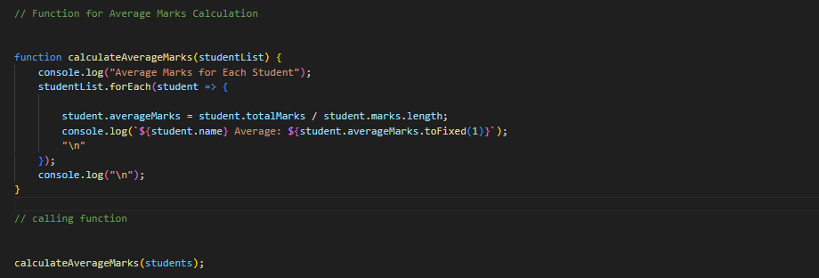
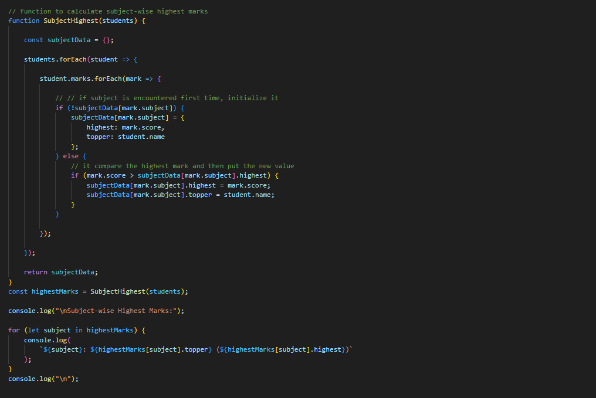
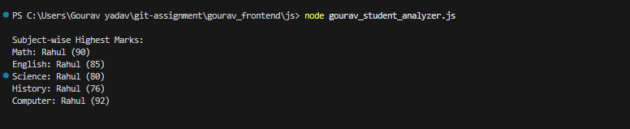
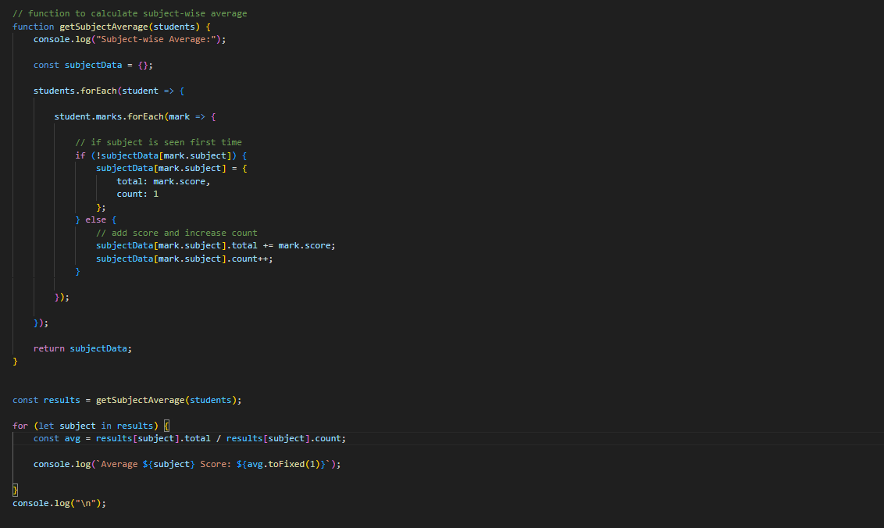
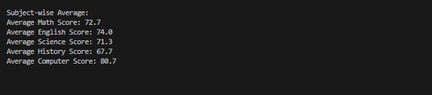
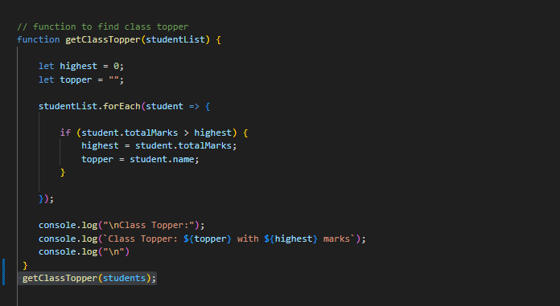
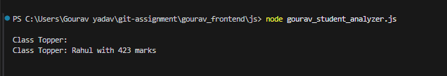
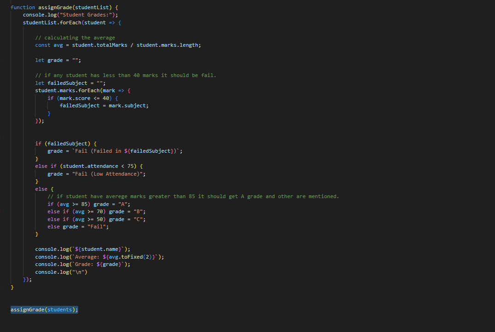
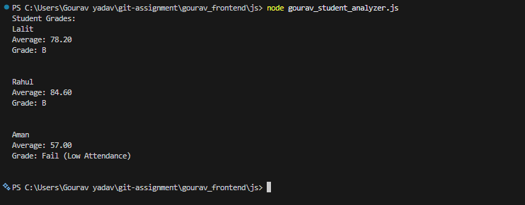

## Screenshots

---

### 1. Students Data Structure

This screenshot shows the structured data of students used in the program. It includes student names, subject-wise marks, and attendance, which are used for all further calculations.

#### . Code

#### . Output

---

### 2. Total Marks

This screenshot shows the total marks calculated for each student by summing all subject scores.

#### . Code

#### . Output

---

### 3. Average Marks (Each Student)

This screenshot shows the average marks calculated for each student by dividing total marks by number of subjects.

#### . Code

#### . Output

---

### 4. Subject-wise Highest Marks

This screenshot shows the highest marks scored in each subject along with the student name. The program uses nested loops and dynamic object storage to track the highest values.

#### . Code

#### . Output

---

### 5. Subject-wise Average

This screenshot shows the average marks for each subject calculated by summing all student scores and dividing by the number of students.

#### . Code

#### . Output

---

### 6. Class Topper

This screenshot shows the student with the highest total marks in the class. The program compares total marks of all students to determine the topper.

#### . Code

#### . Output

---

### 7. Grades and Fail Conditions

This screenshot shows the average marks, assigned grade, and fail conditions for each student. The program first checks fail conditions (subject marks ≤ 40 or attendance < 75), then assigns grades based on average.

#### . Code

#### . Output

