# Product Inventory Dashboard  

## Project Overview  
This is a client-side Product Inventory Dashboard built using HTML, CSS, and JavaScript.

The application allows users to manage products by adding, deleting, searching, filtering, and sorting them. All data is stored in localStorage, so it remains saved even after refreshing the page.

## Tech Stack  

- HTML5  
- CSS3  
- JavaScript
- localStorage  
- Promise + setTimeout  

## Project Structure  

mini_app/  
└── product_inventory_dashboard/  
      ├── index.html  
      ├── css/  
      │   └── style.css  
      ├── js/  
      │   └── script.js  
      └── README.md  

    ## How to Run  

1. Clone or download the repository  
2. Open the project folder  
3. Open index.html in any browser  

✨ Features  

### 🔹 Core Features  

- Dynamic Product Rendering  
- Search Functionality  
- Category Filtering  
- Low Stock Filter  
- Sorting Options  
- Inventory Analytics Dashboard  
- Add Product Feature  
- Delete Product Feature  
- Data Persistence (localStorage)  
- Simulated API Loading  

---

### 🌟 Bonus Features  

- Edit Product Functionality  
- Multiple Filters Working Together  
- Responsive Design  
- Category-wise Analytics  
- Empty State Handling  

## 📸 Screenshots  

### Dashboard View  
Shows all products in a grid along with inventory analytics like total products, total value, and out-of-stock count.  

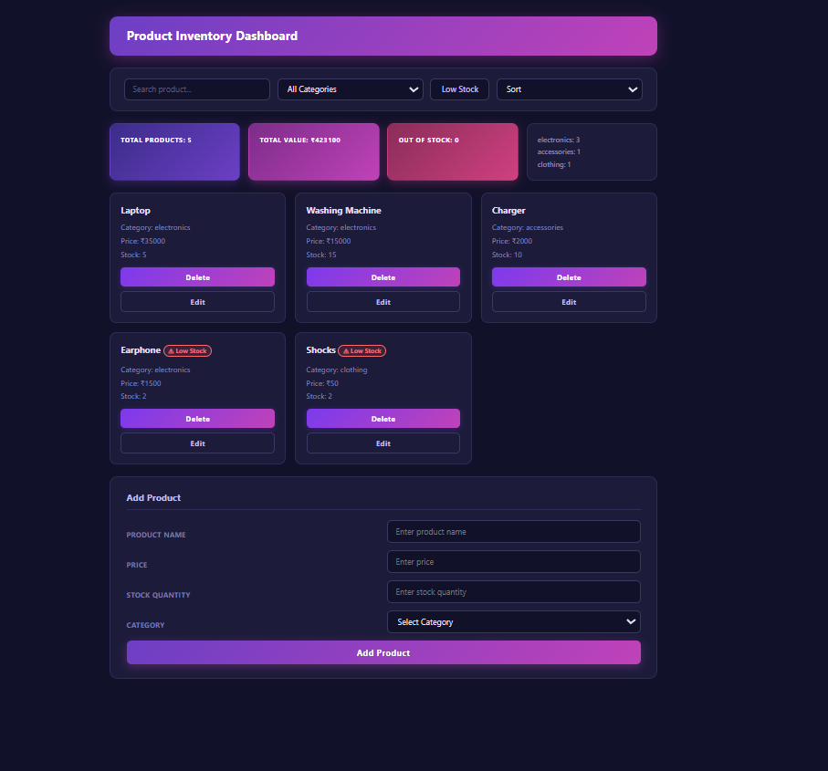

---

### Search Functionality  
Shows how products are filtered in real time when typing in the search bar.  

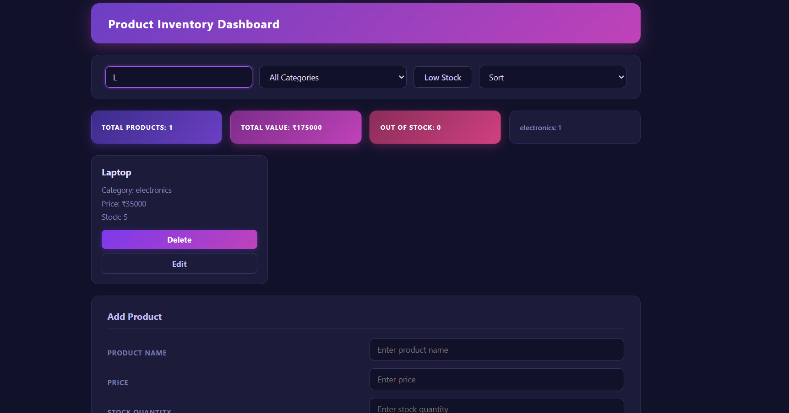

---

### Category Filter  
Displays how products change based on selected category from dropdown.  

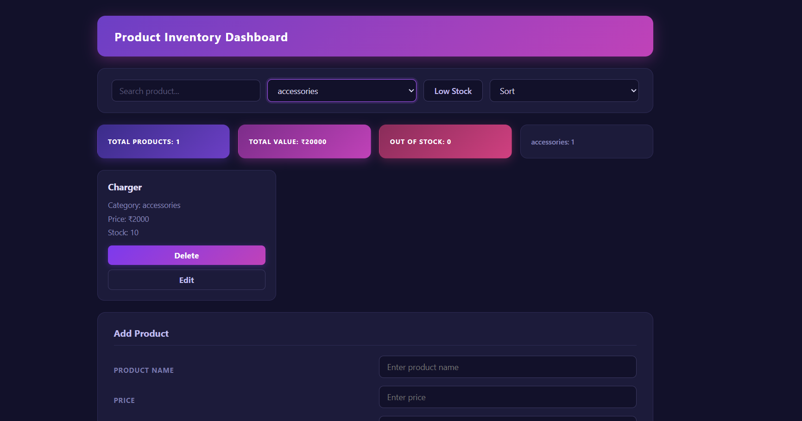

---

### Low Stock Filter  
Shows only products with stock less than 5 when the filter is applied.  

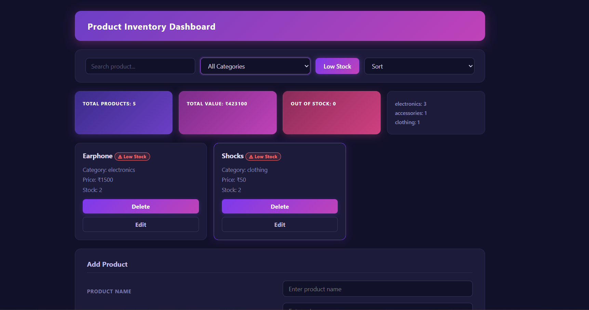

---

### Sorting Feature  
Demonstrates sorting of products by price and alphabetical order.  

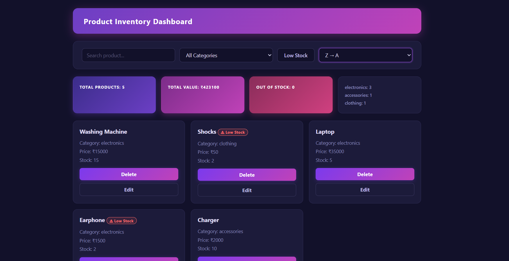

---

### Delete Product  
Shows how a product is removed from the dashboard after clicking delete.  
When you click on delete button the product get removed.

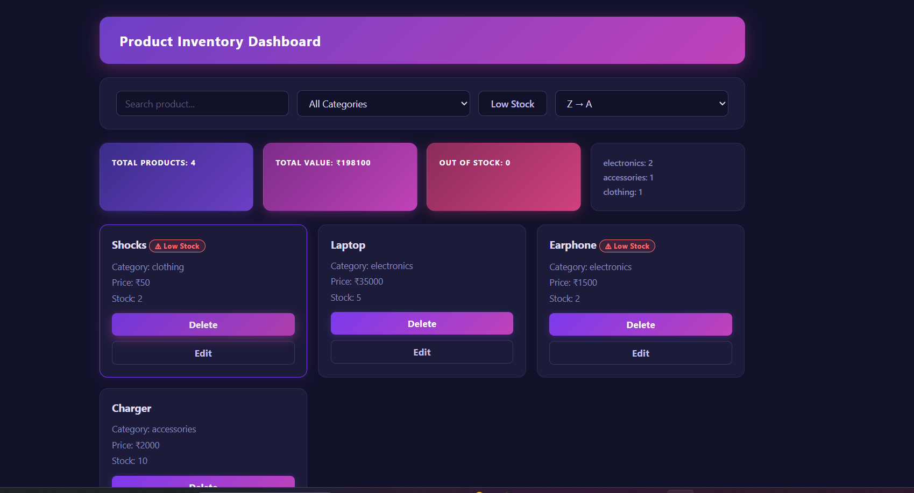

---

### Empty State  
Displays message when no products match search or filters.  

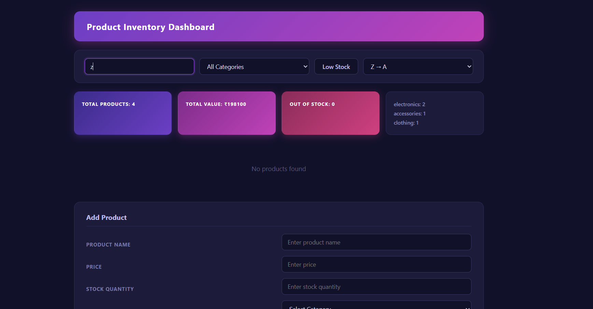

---

### Add Product Form  
Allows users to add a new product by entering name, price, stock, and category. The product appears instantly after submission.  
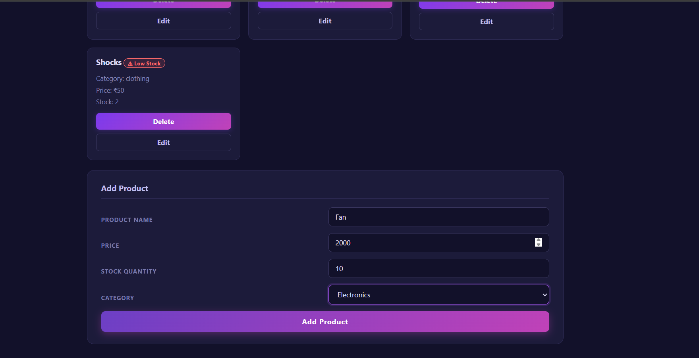

---

### Category Analytics  
Displays the number of products available in each category.  
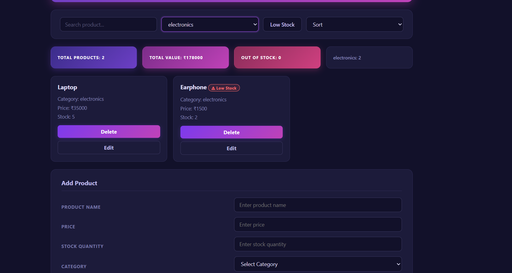

---
### Add Product Validation  
Shows validation message when invalid input is submitted in the form.  
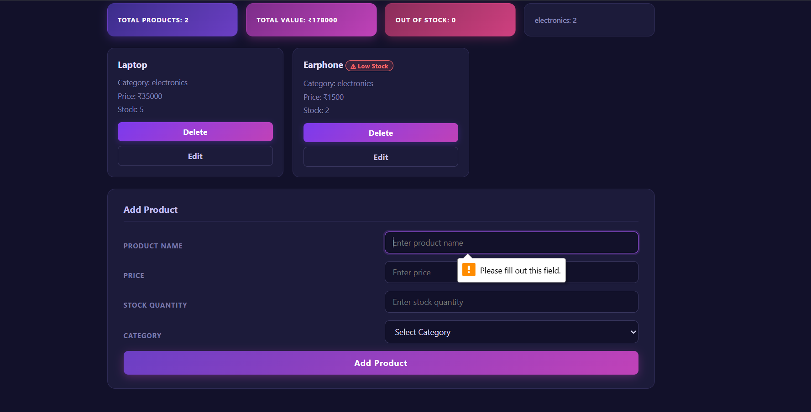

### Loading State  
Shows a loading message displayed when the page initially loads before products are rendered.  
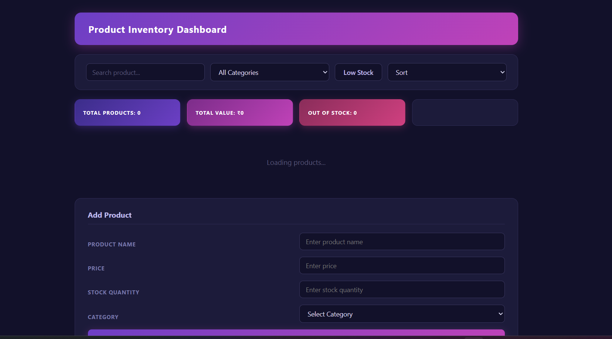

---
### Multiple Filters Combined  
Shows how search, category filter, low stock filter, and sorting work together at the same time without breaking functionality.  
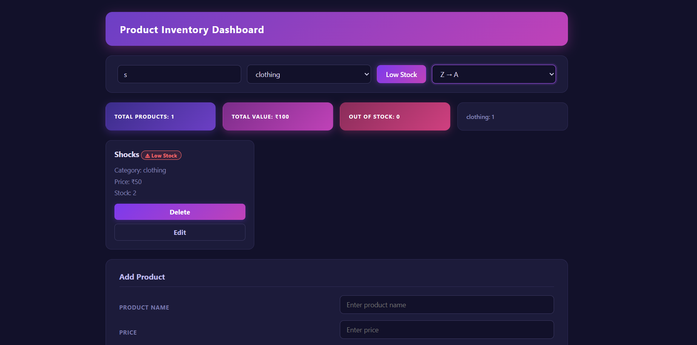

---
### Responsive Mobile View  
Shows how the layout adapts for smaller screens, with stacked sections and a user-friendly mobile interface.  
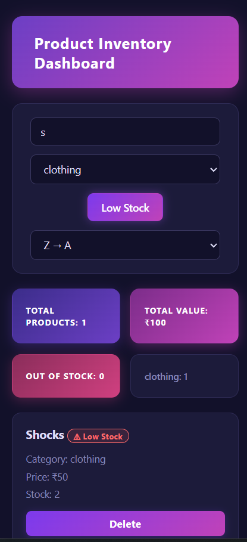

---
### Edit Product (Modal)  
Allows users to update product details using a popup form without leaving the dashboard.  
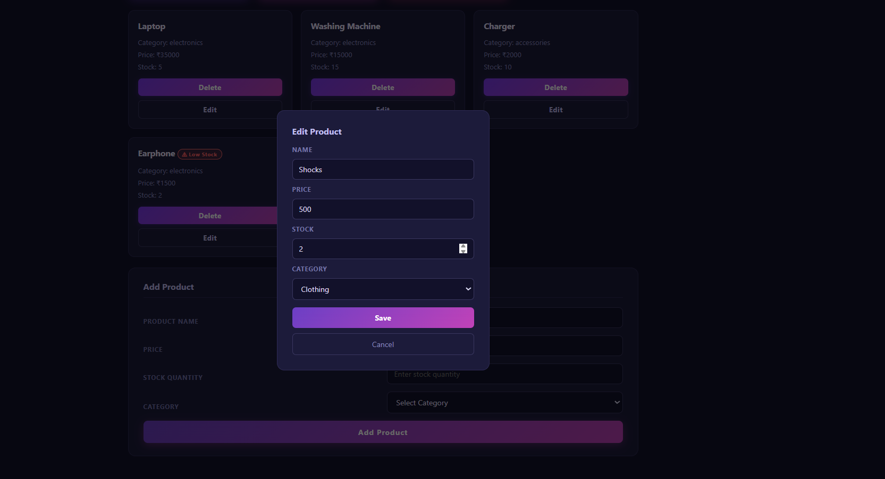

---
### localStorage Data  
Shows how product data is stored in the browser using localStorage.  
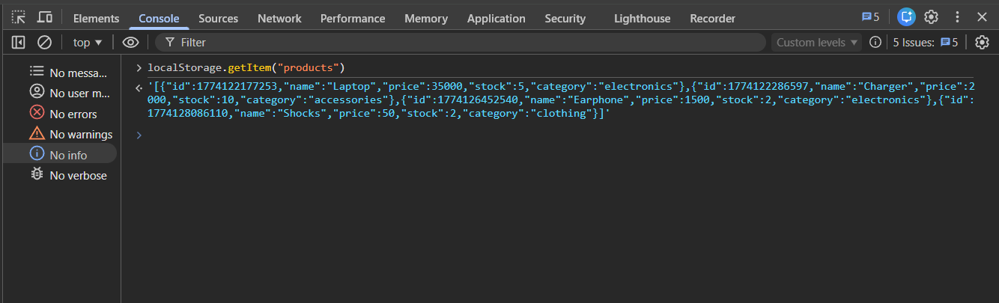

---

